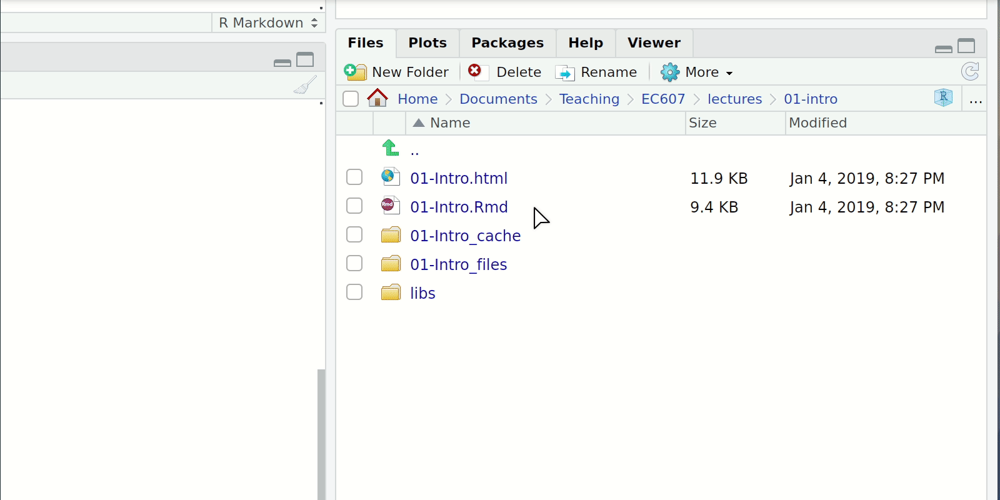

```{css, echo=FALSE}
# CSS for including pauses in printed PDF output (see bottom of lecture)
@media print {
  .has-continuation {
    display: block !important;
  }
}
```

```{r setup, include=FALSE}
# xaringanExtra::use_scribble() ## Draw on slides. Requires dev version of xaringanExtra.

options(htmltools.dir.version = FALSE)
library(knitr)
opts_chunk$set(
  fig.align="center",  
  fig.height=4, #fig.width=6,
  # out.width="748px", #out.length="520.75px",
  dpi=300, #fig.path='Figs/',
  cache=T#, echo=F, warning=F, message=F
  )
library(tidyverse)
library(hrbrthemes)
library(fontawesome)
```


# Table of contents

1. [Prologue](#prologue)

2. [Syllabus highlights](#syllabus)

3. [Getting started](#started)

4. [R for data science](#r4ds)

5. [Data visualization with ggplot2](#ggplot2)

`r fa('star-of-life')` Slides adapted from Grant McDermott's EC 607 at University of Oregon.


---
class: inverse, center, middle
name: prologue

# Prologue

<html><div style='float:left'></div><hr color='#EB811B' size=1px width=796px></html>

---

# Introductions

### Me

`r fa('address-book')` [Alex Marsh](https://alexiom.github.io/)

`r fa('envelope')` [alex.marsh@unc.edu](mailto:alex.marsh@unc.edu)

`r fa('graduation-cap')` Fourth Year Economics PhD Student (Empirical IO, Empirical Auctions, and Applied Econometrics)

--

`r fa('home')` Hurricane, WV

--

`r fa('user-graduate')` Undergraduate: Belmont University in Nashville, TN

--

`r fa('user-graduate')` Master's: A private research university in Durham, NC `r fa('smile')` .

I enjoy:

`r fa('guitar')` Playing guitar

`r fa('dragon')` D&D

`r fa('hockey-puck')` Nashville Predators

---
class: inverse, center, middle
name: syllabus

# Syllabus Highlights

<html><div style='float:left'></div><hr color='#EB811B' size=1px width=796px></html>

(Read the full document [here](https://alexmarsh.io/files/ECON370_Syllabus_Fall2022.pdf).)

---

# Why this course?

Fill in the gaps left by traditional econometrics and methods classes.

- Practical skills that tools that will complement your other econometric courses.
- Neglected skills like how to actually find datasets in the wild and clean them.

Data science skills are largely distinct from (and complementary to) the core 'metrics curriculum familiar to economists.

- Data viz, cleaning and wrangling; programming; cloud computation; relational databases; machine learning; etc.

---
# Grading

| Component                           | Weight |
|:-|-:|
| 5 × homework assignments            | 60% |
| 1 × final project		                | 30% |
| Participation    		                | 10% |

- Number of homework assignments might change.
 - Regardless, will be equally weighted.
 - Individual weight = 60/$n$.
- Homework assignments may be done in groups of at most 3.
 - If done in groups *all group members are still expected to program on their own.*
 - If done in groups, *please submit only one assignment.*
- I will be requiring you to submit assignments with an R Markdown file and an R script.
 - Discuss details when the first assignment comes up.
- [Final Project](https://github.com/alexiom/ECON370/tree/main/final_project) 
 - Details TBD.


---
# Course Overview

## Course Goals

1. Teach students how to competently program in R with good style,
2. Teach students how to think and approach problems from a computational perspective,
3. Teach students basic data science skills including data visualization and basic models,
4. Imbue students with a desire to learn more about econometrics and data science.


---

# Course Overview

## Learning Objectives

1. Be able to write functioning,  readable,  and aesthetically pleasing code in the R programming language,
2.  Give raw data, be able to manipulate the data into the correct format needed for an analysis,
3.  Given data and a research question, be able to create a exploratory data visualization in the right format to get at answering the question,
4.  Be able to communicate results to a non-technical audience.

---

# Lecture outline

### Introduction

- Introduction: Motivation, software installation, and data visualization
- R language basics (will take some time)

### Applications of Numerical Programming

Topics here are good to know but are mostly to practice programming

- Simulation
- Optimization

### Data skills

- data.table and dplyr
- Merging
- Data sources and scrapping (might have to skip)

---
# Lecture Outline (Cont.)

### Basics of Data Science

- Data Visualization
- Regression
- Classification

### Speakers
- We will have a few speakers from industry come throughout the semester
- TBD

---
# Textbooks and Resources

I will be pulling from various books that are publicly available.

There is one book that I like that I don't believe is legally publicly available.
- *Learning R* by Richard Cotton

The remaining books are publicly available.
- [*R for Data Science* by Hadley Wickham and Garrett Grolemund](https://r4ds.had.co.nz)
- [*Hands-On Programming with R* by Garrett Grolemun](https://rstudio-education.github.io/hopr/)
- [*An Introduction to Statistical Learning with Applications in R* by Gareth James, Daniela Witten, Trevor Hastie, and Robert Tibshirani](https://web.stanford.edu/~hastie/ISLRv2_website.pdf)

[Swirl: Learn R, in R](https://swirlstats.com/students.html)
- Great resource to learn the basics of R within R

---
class: inverse, center, middle
name: started

# Getting started

<html><div style='float:left'></div><hr color='#EB811B' size=1px width=796px></html>

---

# Software installation and registration

1. Download [R](https://www.r-project.org/).

2. Download [RStudio](https://www.rstudio.com/products/rstudio/download/preview/).

```{r, cache=FALSE,echo=FALSE,out.width="49%",out.height="20%",fig.show='hold',fig.align='center'}
knitr::include_graphics(c("pics/RStudio.png"))
```

--

If you had trouble completing any of these steps, please raise your hand.

---

# Some OS-specific extras

I'll detail further software requirements as and when the need arises. However, to help smooth some software installation issues further down the road, please also do the following (depending on your OS):

- **Windows:** Install [Rtools](https://cran.r-project.org/bin/windows/Rtools/). 
- **Mac:** Might need to install Xcode later. This can take awhile, so I will let you know.
- **Linux:** None (you should be good to go).

---

# Checklist

☑ Do you have the most recent version of R?
  ```{r, cache=FALSE}
  version$version.string
  ```


☑ Do you have the most recent version of RStudio? (The [preview version](https://www.rstudio.com/products/rstudio/download/preview/) is fine.)
  ```{r eval=FALSE}
  RStudio.Version()$version
  ## Requires an interactive session but should return something like "[1] ‘1.4.1100’"
  ```

☑ Have you updated all of your R packages? 
  ```{r eval=FALSE}
  update.packages(ask = FALSE, checkBuilt = TRUE)
  ```

---
class: inverse, center, middle
name: r4ds

# R for data science
<html><div style='float:left'></div><hr color='#EB811B' size=1px width=796px></html>

---
name: whyr

# Why R and RStudio? (cont.)
```{R, indeeddotcom, echo = F, fig.height = 6, fig.width = 9, dev = "svg"}
# The popularity data
pop_df = 
  data.frame(
  lang = c("SQL", "Python", "R", "SAS", "Matlab", "SPSS", "Stata"),
  n_jobs = c(107130, 66976, 48772, 25644, 11464, 3717, 1624),
  free = c(T, T, T, F, F, F, F)
  )
## Plot it
pop_df %>% 
  mutate(lang = lang %>% factor(ordered = T)) %>%
  ggplot(aes(x = lang, y = n_jobs, fill = free)) +
  geom_col() +
  geom_hline(yintercept = 0) +
  aes(x = reorder(lang, -n_jobs), fill = reorder(free, -free)) +
  xlab("Statistical language") +
  scale_y_continuous(label = scales::comma) +
  ylab("Number of jobs") +
  labs(
    title = "Comparing statistical languages",
    subtitle = "Number of job postings on Indeed.com, 2019/01/06"
    ) +
  scale_fill_manual(
    "Free?",
    labels = c("True", "False"),
    values = c("#f92672", "darkslategray")
    ) +
  ggthemes::theme_pander(base_size = 17) +
  # theme_ipsum() +
  theme(legend.position = "bottom")
```

---

# Why R and RStudio? (cont.)

### Data science positivism

- Alongside Python, R has become the *de facto* language for data science.
  - See: [*The Impressive Growth of R*](https://stackoverflow.blog/2017/10/10/impressive-growth-r/), [*The Popularity of Data Science Software*](http://r4stats.com/articles/popularity/)
- Open-source (free!) with a global user-base spanning academia and industry.
  - "Do you want to be a profit source or a cost center?"

### Bridge to applied economics and other tools

- Already has all of the statistics and econometrics support, and is amazingly adaptable as a “glue” language to other
programming languages and APIs.
- The RStudio IDE and ecosystem allow for further, seemless integration.

### Path dependency

- It's also the language that I know best.
--

- (Learning multiple languages is a good idea, though.)

---
# Pros and Cons of R

`r fa('check')` Syntax is fairly basic for those with a math background.

--

`r fa('check')` Great community with lots of support.

--

`r fa('check')` Free.

--

`r fa('check')` RStudio.

--

`r fa('check')` Beautiful Graphics (better than Python `r fa('smile')`).

--

`r fa('check')` Data wrangling.

--

`r fa('times')` Slow.

--

`r fa('times')` Demanding on RAM.

--

`r fa('times')` Dependency on packages.

---
# R vs Python

Both R and Python are common data science languages.

However, Python is arguably the more important language in industry.

--

So why not learn Python for this class?

--

1. I think R is the easier of the two to get started learning.
2. There is much commonality between the two with just a few quirks.
3. R is better for learning statistics as it is ultimately a programming language designed with statistical computing in mind.

--

R is a language for statistics whereas Python is a language that can do statistics.

---

# Some R basics

1. Everything is an object.

2. Everything has a name.

3. You do things using functions.

4. Functions come pre-written in packages (i.e. "libraries"), although you can — and should — write your own functions too.

--

</br>

Points 1. and 2. can be summarized as an [object-orientated programming](https://en.wikipedia.org/wiki/Object-oriented_programming) (OOP) approach.
  - This may sound super abstract now, but we'll see *lots* of examples over the coming weeks that will make things clear.

---

# R vs Stata

If you're coming from Stata, some additional things worth emphasizing:

- Multiple objects (e.g. data frames) can exist happily in the same workspace. 
   - No more `keep`, `preserve`, `restore` hackery. (Though, props to [Stata 16](https://www.stata.com/new-in-stata/multiple-datasets-in-memory/).)
   - This is a direct consequence of the OOP approach.

- You will load packages at the start of every new R session. Make peace with this.
  - "Base" R comes with tons of useful in-built functions. It also provides all the tools necessary for you to write your own functions. 
  - However, many of R's best data science functions and tools come from external packages written by other users.

- R easily and infinitely parallelizes. For free.
  - Compare the cost of a [Stata/MP](https://www.stata.com/statamp/) license, nevermind the fact that you effectively pay per core...

- You don't need to `tset or xtset` your data. (Although you can too.)

---

# R code example (linear regression)

```{r fit}
fit = lm(mpg ~ wt, data = mtcars)
summary(fit)
```

---

# Base R plot

```{r mtcars_baseplot, dev="svg"}
par(mar = c(4, 4, 1, .1)) ## Just for nice plot margins on this slide deck
plot(mtcars$wt, mtcars$mpg)
abline(fit, col = "red")
```

---

# ggplot2

```{r mtcars_ggplot, dev="svg"}
library(ggplot2)
ggplot(data = mtcars, aes(x = wt, y = mpg)) + 
  geom_smooth(method = "lm", col = "red") + 
  geom_point() 
```

---
class: inverse, center, middle
name: ggplot2

# More ggplot2
<html><div style='float:left'></div><hr color='#EB811B' size=1px width=796px></html>

---

# Install and load

Open up your laptops. For the remainder of this first lecture, we're going continue playing around with [ggplot2](https://ggplot2.tidyverse.org/) (i.e. livecoding).

If you don't have them already, install the `ggplot2` and `gapminder` packages via either:
- **Console:** Enter `install.packages(c("ggplot2", "gapminder"), dependencies=T)`.
- **RStudio:** Click the "Packages" tab in the bottom-right window pane. Then click "Install" and search for these two packages.
  


---

# Install and load (cont.)

Once the packages are installed, load them into your R session with the `library()` function.
```{r pkg_load}
library(ggplot2)
library(gapminder) ## We're just using this package for the gapminder data
```

Notice too that you don't need quotes around the package names any more. Reason: R now recognises these packages as defined objects with given names. ("Everything in R is an object and everything has a name.")

--

PS — A convenient way to combine the package installation and loading steps is with the [pacman package's](https://github.com/trinker/pacman) `p_load()` function. If you run `pacman::p_load(ggplot, gapminder)` it will first look to see whether it needs to install either package before loading them. Clever.
- We'll get to this next week, but if you want to run a function from an (installed) package without loading it, you can use the `PACKAGE::package_function()` syntax.

---

# Brief aside: The gapminder dataset

Because we're going to be plotting the [gapminder](https://github.com/jennybc/gapminder) dataset, it is helpful to know that it contains panel data on life expectancy, population size, and GDP per capita for 142 countries since the 1950s.

```{r gapm}
gapminder
```


---

# Elements of ggplot2

[Hadley Wickham's](http://hadley.nz/) ggplot2 is one of the most popular packages in the entire R canon. 
- It also happens to be built upon some deep visualization theory: i.e. Leland Wilkinson's [*The Grammar of Graphics*](https://www.amazon.com/Grammar-Graphics-Statistics-Computing/dp/0387245448).

There's a lot to say about ggplot2's implementation of this "grammar of graphics" approach, but the three key elements are:

1. Your plot ("the visualization") is linked to your variables ("the data") through various **aesthetic mappings**.

2. Once the aesthetic mappings are defined, you can represent your data in different ways by choosing different **geoms** (i.e. "geometric objects" like points, lines or bars).

3. You build your plot in **layers**.

--

</br>

That's kind of abstract. Let's review each element in turn with some actual plots.

---

# 1. Aesthetic mappings

```{r, aesthetics0}
ggplot(data = gapminder, mapping = aes(x = gdpPercap, y = lifeExp)) + 
  geom_point()
```


---

# 1. Aesthetic mappings (cont.)

```{r aesthetics1, eval=FALSE}
ggplot(data = gapminder, mapping = aes(x = gdpPercap, y = lifeExp)) + 
  geom_point()
```

Focus on the top line, which contains the initialising `ggplot()` function call. This function accepts various arguments, including:
- Where the data come from (i.e. `data = gapminder`).
- What the aesthetic mappings are (i.e. `mapping = aes(x = gdpPercap, y = lifeExp)`).

--

The aesthetic mappings here are pretty simple: They just define an x-axis (GDP per capita) and a y-axis (life expecancy).
- To get a sense of the power and flexibility that comes with this approach, however, consider what happens if we add more aesthetics to the plot call...

---

# 1. Aesthetic mappings (cont.)

```{r aesthetics2, dev='svg'}
ggplot(data = gapminder, aes(x = gdpPercap, y = lifeExp, size = pop, col = continent)) + 
  geom_point(alpha = 0.3) ## "alpha" controls transparency. Takes a value between 0 and 1.
```

--

Note that I've dropped the "mapping =" part of the ggplot call. Most people just start with "aes(...)", since `ggplot2` knows the order of the arguments.

---

# 1. Aesthetic mappings (cont.)

We can specify aesthetic mappings in the geom layer too.
```{r aesthetics3, dev='svg'}
ggplot(data = gapminder, aes(x = gdpPercap, y = lifeExp)) + ## Applicable to all geoms
  geom_point(aes(size = pop, col = continent), alpha = 0.3) ## Applicable to this geom only
```

---

# 1. Aesthetic mappings (cont.)

Oops. What went wrong here?
```{r aesthetics_mistake, warning=FALSE,dev='svg'}
ggplot(data = gapminder, aes(x = gdpPercap, y = lifeExp)) + 
  geom_point(aes(size = "big", col="black"), alpha = 0.3)
```

---

# 1. Aesthetic mappings (cont.)

This is what we wanted to do!

```{r aesthetics_mistake_correct, warning=FALSE,dev='svg'}
ggplot(data = gapminder, aes(x = gdpPercap, y = lifeExp)) + 
  geom_point(size = 3, col="black", alpha = 0.3)
```


--

**Note: ** `size` must take a numeric argument, not a character.

---

# 1. Aesthetic mappings (cont.)

At this point, instead of repeating the same ggplot2 call every time, it will prove convenient to define an intermediate plot object that we can re-use.

```{r p, dev='svg'}
p = ggplot(data = gapminder, aes(x = gdpPercap, y = lifeExp))
p
```

---

# 2. Geoms

Once your variable relationships have been defined by the aesthetic mappings, you can invoke and combine different geoms to generate different visulaizations.

```{r geoms1, dev='svg'}
p + geom_point(alpha = 0.3)  +
  geom_smooth(method = "loess") 
```

---

# 2. Geoms (cont.)

Aesthetics can be applied differentially across geoms.

```{r geoms2, dev='svg'}
p + geom_point(aes(size = pop, col = continent), alpha = 0.3)  +
  geom_smooth(method = "loess") 
```

---
# 2. Geoms (cont.)

The previous plot provides a good illustration of the power (or effect) that comes from assigning aesthetic mappings "globally" vs in the individual geom layers.
- Compare: What happens if you run the below code chunk?

```{r geoms3}
p_bad = ggplot(data = gapminder, 
               aes(x = gdpPercap, y = lifeExp, size = pop, col = continent)) +
  geom_point(alpha = 0.3)  +
  geom_smooth(method = "loess") 
```

---
# 2. Geoms (cont.)

```{r geoms3_new}
p_bad
```

---

# 2. Geoms (cont.)

Similarly, note that some geoms only accept a subset of mappings. E.g. `geom_density()` doesn't know what to do with the "y" aesthetic mapping.

```{r geoms4, error=TRUE, dev='svg'}
p + geom_density()
```

---

# 2. Geoms (cont.)

We can fix that by being more careful about how we build the plot.

```{r geoms5, dev='svg'}
ggplot(data = gapminder) + ## i.e. No "global" aesthetic mappings"
  geom_density(aes(x = gdpPercap, fill = continent), alpha=0.3)
```

---

# 3. Build your plot in layers

We've already seen how we can chain (or "layer") consecutive plot elements using the `+` connector.
- The fact that we can create and then re-use an intermediate plot object (e.g. "p") is testament to this.

But it bears repeating: You can build out some truly impressive complexity and transformation of your visualization through this simple layering process.
- You don't have to transform your original data; ggplot2 takes care of all of that.
- For example (see next slide for figure).

```{r layers1}
p2 =
  p +
  geom_point(aes(size = pop, col = continent), alpha = 0.3) +
  scale_color_brewer(name = "Continent", palette = "Set1") + ## Different colour scale
  scale_size(name = "Population", labels = scales::comma) + ## Different point (i.e. legend) scale
  scale_x_log10(labels = scales::dollar) + ## Switch to logarithmic scale on x-axis. Use dollar units.
  labs(x = "Log (GDP per capita)", y = "Life Expectancy") + ## Better axis titles
  theme_minimal() ## Try a minimal (b&w) plot theme
```

---

# 3. Build your plot in layers (cont.)

```{r layers2, dependson=p2, echo=FALSE, dev='svg'}
p2
```

---

# What else?

We have barely scratched the surface of ggplot2's functionality... let alone talked about the entire ecosystem of packages that has been built around it. 
- Here's are two quick additional examples to whet your appetite

--

Note that you will need to install and load some additional packages if you want to recreate the next two figures on your own machine. A quick way to do this:

```{r pacinstall}
if (!require("pacman")) install.packages("pacman")
pacman::p_load(hrbrthemes, gganimate)
```

---

# What else? (cont.)

Simple extension: Use an external package theme.
```{r modern_rc_theme, dependson=p2, dev='svg'}
# library(hrbrthemes)
p2 + theme_modern_rc() + geom_point(aes(size = pop, col = continent), alpha = 0.2)
```

---

# What else? (cont.)

Elaborate extension: Animation! (See the next slide for the resulting GIF.)
```{r gganim1, eval=FALSE}
library(gganimate)
library(magick)

ggplot(gapminder, aes(gdpPercap, lifeExp, size = pop, colour = country)) +
  geom_point(alpha = 0.7, show.legend = FALSE) +
  scale_colour_manual(values = country_colors) +
  scale_size(range = c(2, 12)) +
  scale_x_log10() +
  facet_wrap(~continent) +
  # Here comes the gganimate specific bits
  labs(title = 'Year: {frame_time}', x = 'GDP per capita', y = 'life expectancy') +
  transition_time(year) +
  ease_aes('linear')
```

---

# What else? (cont.)

```{r ggamin2, echo=FALSE,message=FALSE}
library(gganimate)
library(gapminder)
library(magick)

ggplot(gapminder, aes(gdpPercap, lifeExp, size = pop, colour = country)) +
  geom_point(alpha = 0.7, show.legend = FALSE) +
  scale_colour_manual(values = country_colors) +
  scale_size(range = c(2, 12)) +
  scale_x_log10() +
  facet_wrap(~continent) +
  # Here comes the gganimate specific bits
  labs(title = 'Year: {frame_time}', x = 'GDP per capita', y = 'life expectancy') +
  transition_time(year) +
  ease_aes('linear')
```

--

Note that this animated plot provides a much more intuitive understanding of the underlying data. Just as [Hans Rosling](https://www.ted.com/talks/hans_rosling_the_best_stats_you_ve_ever_seen) intended.

---
# What else? (cont.)

There's a lot more to say, but I think we'll stop now for today's lecture.

We also haven't touched on ggplot2's relationship to "tidy" data.
  - It actually forms part of a suite of packages collectively known as the [tidyverse](https://www.tidyverse.org/). 
  - We will get back to this in later lectures.

Rest assured, you will be using ggplot2 throughout the rest of this course and developing your skills along the way.

In the meantime, I want you to do some reading and practice on your own. Pick either of the following (or choose among the litany of online resources) and work through their examples:
- [Chapter 3](https://r4ds.had.co.nz/data-visualisation.html) of *R for Data Science* by Hadley Wickham and Garett Grolemund.
- [*Data Visualization: A Practical Guide*](https://socviz.co/makeplot.html) by Kieran Healy.
- [Designing ggplots](https://designing-ggplots.netlify.com) by Malcom Barrett.

---
class: inverse, center, middle

# Next lecture: Getting started with R.
<html><div style='float:left'></div><hr color='#EB811B' size=1px width=796px></html>

```{r gen_pdf, include = FALSE, cache = FALSE, eval = TRUE}
infile = list.files(pattern = '.html')
pagedown::chrome_print(input = infile, timeout = 100)
```
