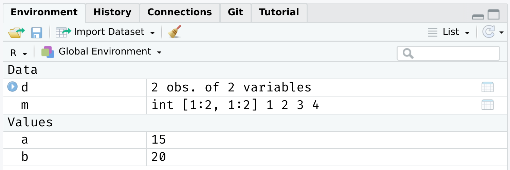

name: toc

```{css, echo=FALSE}
@media print {
  .has-continuation {
    display: block !important;
  }
}
```

```{r setup, include=FALSE}
options(htmltools.dir.version = FALSE)
library(knitr)
opts_chunk$set(
  fig.align="center", #fig.width=6, fig.height=4.5, 
  # out.width="748px", #out.length="520.75px",
  dpi=300, #fig.path='Figs/',
  cache=F#, echo=F, warning=F, message=F
  )
library(fontawesome)
```

# Table of contents

1. [Introduction](#intro)

2. [Object-oriented programming in R](#oop)

3. ["Everything is an object"](#eobject)

4. ["Everything has a name"](#ename)

5. [Indexing](#indexing)

6. [Cleaning up](#cleaning)

`r fa('star-of-life')` Slides adapted from Grant McDermott's EC 607 at University of Oregon.

---
class: inverse, center, middle
name: intro

# Introduction

<html><div style='float:left'></div><hr color='#EB811B' size=1px width=796px></html>

(Some important R concepts)

---

# Agenda

Today will be more high level than the last few lectures.

- While there will be some coding, this will mostly be solidifying and clarifying certain concepts.

I want everyone to feel comfortable in RStudio and to understand how to make scripts and RMarkdown documents.

- I want you to get comfortable typing R commands yourself — and navigating the RStudio IDE — without resorting to copy+paste.
- Slightly more painful in the beginning, but much better payoff in the long-run.


---
class: inverse, center, middle
name: oop

# Object-oriented programming in R

<html><div style='float:left'></div><hr color='#EB811B' size=1px width=796px></html>

---

# Motivation

In our very first lecture, I mentioned R's approach to [object-oriented programming](https://en.wikipedia.org/wiki/Object-oriented_programming) (OOP), which is often summarized as:

> **"Everything is an object and everything has a name."**

--

In the next two sections, I want to dive into this idea a little more. I also want to preempt some issues that might trip you up if you new to R or OOP in general.
- At least, they were things that tripped me up at the beginning.

--

The good news, as well see, is that avoiding and solving these issues is pretty straightforward.
- Not to mention: A very small price to pay for the freedom and control that R offers us.

---

# Disclaimer

Okay, this slide is just to let you know that I'm being a little fast and loose with terms.

Most obviously, there are actually _multiple_ OOP frameworks in R.
- **S3**, **S4**, **R6**...
- Hadley Wickham's "Advanced R" provides a [very thorough overview](https://adv-r.hadley.nz/oo.html) of the main ones.

But for our purposes, I think it is much more helpful to think about (a) the shared characteristics of these different systems and (b) the broad implications of OOP in R.
- What we lose in detail, we hopefully gain in perspective.
- But do read Hadley's book if you get the chance. It's incredibly helpful (as are all his books).

---
class: inverse, center, middle
name: eobject

# "Everything is an object"
<html><div style='float:left'></div><hr color='#EB811B' size=1px width=796px></html>

---

# What are objects? 

It's important to emphasise that there are many different *types* (or *classes*) of objects. 

We'll revisit the issue of "type" vs "class" in a slide or two. For the moment, it is helpful simply to name some objects that we'll be working with regularly:
- vectors
- matrices
- data frames
- lists
- functions
- etc.

--

Most likely, you already have a good idea of what distinguishes these objects and how to use them.
- However, bear in mind that there subtleties that may confuse while you're still getting used to R. 
- E.g. There are different kinds of data frames. We'll soon encounter "[tibbles](https://tibble.tidyverse.org/)" and "[data.tables](https://rdatatable.gitlab.io/data.table/articles/datatable-intro.html#what-is-datatable-1a)", which are enhanced versions of the standard data frame in R. 

---

# What are objects? (cont.)

Each object class has its own set of rules ("methods") for determining valid operations.
- For example, you can perform many of the same operations on matrices and data frames. But there are some operations that only work on a matrix, and vice versa.
- At the same time, you can (usually) convert an object from one type to another.

```{r d}
## Create a small data frame called "d".
d = data.frame(x = 1:2, y = 3:4) 
d
```

```{r m}
## Convert it to (i.e. create) a matrix call "m".
m = as.matrix(d)
m
```

---

# Object class, type, and structure

Use the `class`, `typeof`, and `str` commands if you want understand more about a particular object.

```{r}
# d = data.frame(x = 1:2, y = 3:4) ## Create a small data frame called "d".
class(d) ## Evaluate its class.
typeof(d) ## Evaluate its type.
str(d) ## Show its structure.
```

--

PS — Confused by the fact that `typeof(d)` returns "list"? See [here](https://stackoverflow.com/questions/45396538/typeofdata-frame-shows-list-in-r).

---

# Object class, type, and structure (cont.)

Of course, you can always just inspect/print an object directly in the console.
- E.g. Type `d` and hit Enter.


The `View()` function is also very helpful. This is the same as clicking on the object in your RStudio *Environment* pane. (Try both methods now.)
- E.g. `View(d)`.

---
name: global_env

# Global environment

Let's go back to the simple data frame that we created a few slides earlier.
```{r}
d
```

--

Now, let's try to run a regression<sup>1</sup> on these "x" and "y" variables:

.footnote[
<sup>1</sup> Yes, this is a dumb regression with perfectly co-linear variables. Just go with it. 
]

```{r, error=T}
lm(y ~ x) ## The "lm" stands for linear model(s)
```

--

Uh-oh. What went wrong here? (Answer on next slide.)

---

# Global environment (cont.)

The error message provides the answer to our question:

```
*## Error in eval(predvars, data, env): object 'y' not found
```

--

R can't find the variables that we've supplied in our [Global Environment](https://www.datamentor.io/r-programming/environment-scope/):



--

Put differently: Because the variables "x" and "y" live as separate objects in the global environment, we have to tell R that they belong to the object `d`.
- Think about how you might do this before clicking through to the next slide.

---

# Global environment (cont.)

There are a various ways to solve this problem. One is to simply specify the datasource:

```{r}
lm(y ~ x, data = d) ## Works when we add "data = d"!
```

--

I wanted to emphasize this global environment issue, because it is something that Stata users (i.e. many economists) struggle with when they first come to R.
- In Stata, the entire workspace essentially consists of one (and only one) data frame. So there can be no ambiguity where variables are coming from.
- However, that "convenience" comes at a really high price IMO. You can never read more than two separate datasets (let alone object types) into memory at the same time, have to resort all sorts of hacks to add summary variables to your dataset, etc. 
- Speaking of which...


---

# Working with multiple objects

As I keep saying, R's ability to keep multiple objects in memory at the same time is a huge plus when it comes to effective data work. 
- E.g. We can copy an exiting data frame, or create new one entirely from scratch. Either will exist happily with our existing objects in the global environment.

```{r d2}
d2 = data.frame(x = rnorm(10), y = runif(10))
```


---

# Working with multiple objects (cont.)

Again, however, it does mean that you have to pay attention to the names of those distinct data frames and be specific about which objects you are referring to.
- Do we want to run a regression of "y" on "x" from data frame `d` or data frame `d2`?

---
class: inverse, center, middle
name: ename

# "Everything has a name"

<html><div style='float:left'></div><hr color='#EB811B' size=1px width=796px></html>

---

# Reserved words

We've seen that we can assign objects to different names. However, there are a number of special words that are "reserved" in R.
- These are are fundamental commands, operators and relations in base R that you cannot (re)assign, even if you wanted to.
- We already encountered examples with the logical operators.

See [here](http://stat.ethz.ch/R-manual/R-devel/library/base/html/Reserved.html) for a full list, including (but not limited to):

```R
if 
else 
while 
function 
for
TRUE 
FALSE 
NULL 
Inf 
NaN 
NA 
```

---

# Semi-reserved words

In addition to the list of strictly reserved words, there is a class of words and strings that I am going to call "semi-reserved".
- These are named functions or constants (e.g. `pi`) that you can re-assign if you really wanted to... but already come with important meanings from base R.

Arguably the most important semi-reserved character is `c()`, which we use for concatenation; i.e. creating vectors and binding different objects together.

```{r}
my_vector = c(1, 2, 5)
my_vector
```

--

What happens if you type the following? (Try it in your console.)

```R
c = 4
c(1, 2 ,5)
```

???

Vectors are very important in R, because the language has been optimised for them. Don't worry about this now; later you'll learn what I mean by "vectorising" a function.


---

# Semi-reserved words (cont.)

*(Continued from previous slide.)*

In this case, thankfully nothing. R is "smart" enough to distinguish between the variable `c = 4` that we created and the built-in function `c()` that calls for concatenation.

--

However, this is still *extremely* sloppy coding. R won't always be able to distinguish between conflicting definitions. And neither will you. For example:
```{r}
pi
pi = 2
pi
```
--

**Bottom line:** Don't use (semi-)reserved characters!

---

# Namespace conflicts

A similar issue crops up when we load two packages, which have functions that share the same name. E.g. Look what happens we load the `dplyr` package.
```{r}
library(dplyr)
```

--

The messages that you see about some object being *masked from 'package:X'* are warning you about a namespace conflict.
- E.g. Both `dplyr` and the `stats` package (which gets loaded automatically when you start R) have functions named "filter" and "lag".

---

# Namespace conflicts (cont.)

The potential for namespace conflicts is a result of the OOP approach.<sup>1</sup>
- Also reflects the fundamental open-source nature of R and the use of external packages. People are free to call their functions whatever they want, so some overlap is only to be expected.

.footnote[
<sup>1</sup> Similar problems arise in virtually every other programming language (Python, C, etc.)
]

--

Whenever a namespace conflict arises, the most recently loaded package will gain preference. So the `filter()` function now refers specifically to the `dplyr` variant.

But what if we want the `stats` variant? Well, we have two options:
1. Temporarily use `stats::filter()`
2. Permanently assign `filter = stats::filter`

---

# Solving namespace conflicts

### 1. Use `package::function()`

We can explicitly call a conflicted function from a particular package using the `package::function()` syntax. For example:
```{r}
stats::filter(1:10, rep(1, 2))
```

--

We can also use `::` for more than just conflicted cases. 
- E.g. Being explicit about where a function (or dataset) comes from can help add clarity to our code. Try these lines of code in your R console.

```R
dplyr::starwars ## Print the starwars data frame from the dplyr package
scales::comma(c(1000, 1000000)) ## Use the comma function, which comes from the scales package
```

???

The `::` syntax also means that we can call functions without loading package first. E.g. As long as `dplyr` is installed on our system, then `dplyr::filter(iris, Species=="virginica")` will work.
  
---

# Solving namespace conflicts (cont.)

### 2. Assign `function = package::function`
  
A more permanent solution is to assign a conflicted function name to a particular package. This will hold for the remainder of your current R session, or until you change it back. E.g.
```{r, eval=F}
filter = stats::filter ## Note the lack of parentheses.
filter = dplyr::filter ## Change it back again.
```

--

### General advice

I would generally advocate for the temporary `package::function()` solution. 

Another good rule of thumb is that you want to load your most important packages last. (E.g. Load the tidyverse after you've already loaded any other packages.)
  
Other than that, simply pay attention to any warnings when loading a new package and `?` is your friend if you're ever unsure. (E.g. `?filter` will tell you which variant is being used.)
- In truth, problematic namespace conflicts are rare. But it's good to be aware of them. 
  
---

# User-side namespace conflicts

A final thing to say about namespace conflicts is that they don't only arise from loading packages. They can arise when users create their own functions with a conflicting name.
- E.g. If I was naive enough to create a new function called `c()`.

--

</br>

In a similar vein, one of the most common and confusing errors that even experienced R programmers run into is related to the habit of calling objects "df" or "data"... both of which are functions in base R!
- See for yourself by typing `?df` or `?data`.

Again, R will figure out what you mean if you are clear/lucky enough. But, much the same as with `c()`, it's relatively easy to run into problems.
- Case in point: Triggering the infamous "object of type closure is not subsettable" error message. (See from 1:45 [here](https://rstudio.com/resources/rstudioconf-2020/object-of-type-closure-is-not-subsettable/).)

---
class: inverse, center, middle
name: cleaning

# Cleaning up

<html><div style='float:left'></div><hr color='#EB811B' size=1px width=796px></html>

---

# Removing objects (and packages)

Use `rm()` to remove an object or objects from your working environment.
```{r}
a = "hello"
b = "world"
rm(a, b)
```

You can also use `rm(list = ls())` to remove all objects in your working environment (except packages), but this is [frowned upon](https://www.tidyverse.org/articles/2017/12/workflow-vs-script/). 
- Better just to start a new R session.

--

Detaching packages is more complicated, because there are so many cross-dependencies (i.e. one package depends on, and might even automatically load, another.) However, you can try, e.g. `detach(package:dplyr)`
- Again, better just to restart your R session.
  
---

# Removing plots

You can use `dev.off()` to removing any (i.e. all) plots that have been generated during your session. For example, try this in your R console:
```{r, eval=F}
plot(1:10)
dev.off()
```

--

You may also have noticed that RStudio has convenient buttons for clearing your workspace environment and removing (individual) plots. Just look for these icons in the relevant window panels:


```r
demo("graphics", package = "graphics")
```
---

class: inverse, center, middle

# Next lecture(s): Logic and loops

<html><div style='float:left'></div><hr color='#EB811B' size=1px width=796px></html>


```{r gen_pdf, include = FALSE, cache = FALSE, eval = TRUE}
infile = list.files(pattern = '.html')
pagedown::chrome_print(input = infile, timeout = 100)
```