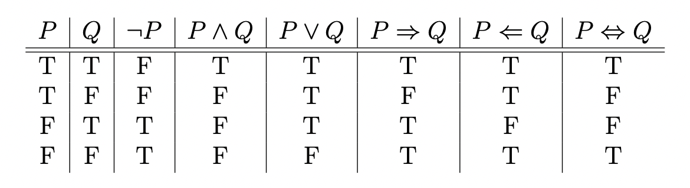

name: toc

```{css, echo=FALSE}
@media print {
  .has-continuation {
    display: block !important;
  }
}
```

```{r setup, include=FALSE}
options(htmltools.dir.version = FALSE)
library(knitr)
opts_chunk$set(
  fig.align="center", #fig.width=6, fig.height=4.5, 
  # out.width="748px", #out.length="520.75px",
  dpi=300, #fig.path='Figs/',
  cache=F#, echo=F, warning=F, message=F
  )
library(fontawesome)
set.seed(123)
```

# Table of contents

1. [Introduction](#intro)

2. [Logic](#logic)

3. [Control Flow](#control)


---
class: inverse, center, middle
name: intro

# Introduction

<html><div style='float:left'></div><hr color='#EB811B' size=1px width=796px></html>

---

# Agenda

This lecture will teach you the bare essentials of logic needed for programming.

While you do not need to master these concepts, there are a few things that will be very important to know.

After touching on logic, we will move on to control flow, which is where knowing some basic logic is very helpful.

---
class: inverse, center, middle
name: logic

# Logic

<html><div style='float:left'></div><hr color='#EB811B' size=1px width=796px></html>

---

# Motivation

When programming, sometimes we'd like for a certain line to execute only when another condition is met.

Other times, we would like to do something different in a bunch of different cases.

Lastly, sometimes we would like to continue to do things until come condition is met.

All these require a basic understanding of logic to implement.

---
# Logical Statements

**Definition:** *A* ***statement (or proposition)*** *is a sentence which can be classified as true or
false without ambiguity. The truth or falsity of the statement is called the* ***truth value.***

--


**Examples**

1. "Every continuous function is differentiable" is a statement with truth value "false."
2. "x < 2" is true for some x and false for some others. If we have a particular context in mind, then it could be a statement. Otherwise it is not.
3. "7 is a prime number." is a statement with truth value.
4. "Every even number greater than 2 is the sum of two primes" is a statement, whose truth value is not known...yet.

---
# Logical Connectives

Many times we would like to combine simple statements to make compound statements. To do this, we need logical connectives to "connect" simple statements into compound statements.

--


**Definition:** *Suppose* $P,Q$ *are both statements, we define the following connectives:*

1. *Negation:* $\neg P$ represents the logical opposite of $P$ 
 - i.e. if $P$ is true, then $\neg P$ is false and vice versa.
2. *Conjunction ("And"):* $P\wedge Q$ is true only when both $P$ and $Q$ are true.
3. *Disjunction ("Or"):* $P \vee Q$ is true if at least one of $P$ and $Q$ is true.
4. *Implication:* $P\implies Q$ is true unless when $P\wedge \neg Q$ is true.
 - Read "If P, then Q."
5. *Equivalence:* $P \iff Q$ is true if both $P\implies Q$ and $Q \implies P$ are true.
 - Read "P if and only if (iff) Q."

--

**Examples**
1. If I am in New York, then I am in the US.
2. If I am in the US, then I am in New York.

---
# Truth Tables

To see the truth value of the logical connectives, we can use what's called a truth table.


We will come back to these shortly.

---
# De Morgan's Laws

De Morgan's Laws states the the following two statements are true.
1. $\neg (P \wedge Q) \iff \neg P \vee \neg Q$
2. $\neg (P \vee Q) \iff \neg P \wedge \neg Q$

In English,
1. "Not (P and Q) is the same as (Not P) or (Not Q)"
1. "Not (P or Q) is the same as (Not P) and (Not Q)"

We're going to go through the proof.

---
# Variations of Conditional Statements

**Definition:** *Suppose* $P$ *and* $Q$ *are statements. Consider the statement* $P\implies Q$, *we further define its*
1. **converse:** $Q\implies P$
2. **inverse:** $\neg P\implies \neg Q$
3. **contrapositive:** $\neg Q \implies \neg P$

--

**Examples** 

Statement: "If I am in New York, then I am in the U.S."
1. **Converse:** "If I am in the U.S., then I am in New York."
2. **Inverse:** "If I am not in New York, then I am not in the U.S."
3. **Contrapositive:** "If I am not in the U.S., then I am not in New York."

--

*The contrapositive and only the contrapositive is logically equivalent to the original statement.*

Or 

$$P\implies Q \iff \neg Q \implies \neg P$$
---
class: inverse, center, middle
name: control

# Control Flow

<html><div style='float:left'></div><hr color='#EB811B' size=1px width=796px></html>

---
# Intro to Control Flow

Control flow refers to ways in which we control the order in which code is executed.

The reason we learned the logic above is because we can use logical gates to control the path our code takes.

```{r, echo=FALSE, out.width="50%", fig.cap="A nice image."}

```

---
# if Statements

If statements are the most fundamental aspect of control flow.

If something is true, then the code is executed. Otherwise, the code moves on.

If statements must take a logical as an input: either `TRUE` or `FALSE`.

```{r}
x = 2
if(x < 0){
  print("x is less than 0")
}
```

Notice nothing printed!

```{r}
x = -1
if(x < 0){
  print("x is less than 0")
}
```

---
# if, else if, and else

However, sometimes we want to check multiple conditions. We can use else if and else statements.

```{r}
x = runif(1,-1,1)
if(x > 0){
  print("x is positive!")
} else if(x < 0){
  print("x is negative!")
} else{
  print("x is 0!")
}
x
```
---
# More on if Statments

Let me show you an example of bad code
```{r}
grade = 85 + rnorm(1,sd=5)
if (grade >= 90) {
  print(paste0("A ",round(grade)," is an A"))
} 
if (grade >= 80 & grade < 90) {
  print(paste0("A ",round(grade)," is a B"))
} 
if (grade >= 70 & grade < 80) {
  print(paste0("A ",round(grade)," is a C"))
} 
if (grade >= 60 & grade < 70) {
  print(paste0("A ",round(grade)," is a D"))
} 
if(grade < 50){
  print(paste0("A ",round(grade)," is an F"))
}
```

---
# More on if Statments

To write clean code, think smart:
```{r}
if (grade >= 90) {
  print(paste0("A ",round(grade)," is an A"))
} else if (grade >= 80) {
  print(paste0("A ",round(grade)," is a B"))
} else if (grade >= 70) {
  print(paste0("A ",round(grade)," is a C"))
} else if (grade >= 60) {
  print(paste0("A ",round(grade)," is a D"))
} else{
  print(paste0("A ",round(grade)," is an F"))
}
```
---
# More on if Statments

The "else if" and "else" statements must be on the same line as the curly bracket:

```{r, error = T}
statement = F
if(statement)
{print("It's True!")
}
else
{print("It's False!")
}
```

```{r, error = T}
statement = F
if(statement)
{print("It's True!")
}else
{print("It's False!")
}
```
---
# More on if Statments

If everything fits on one line, that then don't need curly brackets
```{r}
x1 = if(TRUE) 2 else 3
x2 = if(FALSE) 2 else 3
c(x1,x2)
```

---
# Vectorized if Statments

With the standard if statement, R only allows a single logical value to be supplied. 
 - If a vector is supplied, it only takes the first element.
```{r}
vals = c(T,F)
if(vals){
  print("TRUE!")
}
```

--

To do if else operations with a vector of logicals, use `ifelse()`

```{r}
x = 1:10
ifelse(x %% 2 == 0, "Even","Odd")
```

---
# Conditions

Sometimes we would like to throw an error, warning, or message while controlling the flow of the code.

This can be done with the following respective functions: `stop()`, `warning()`, `message()`.

```{r,error=T}
x = 0
if(x>0){
  print(1/x)
}else if(x<0){
  print(-1/x)
}else{stop("You cannot divide by 0!")}

warning("This is a warning!")
message("This is a message!")
```
---
# Conditions

- Errors stop code from running. These should be used to prevent something very bad from running.
- Warnings will still allow for code to run, but in most cases, caution should be taken when the warning is triggered.
- Messages can be useful when writing functions to see what is happening inside of it.
 - More to come later.

---

class: inverse, center, middle

# Next lecture(s): Loops

<html><div style='float:left'></div><hr color='#EB811B' size=1px width=796px></html>


```{r gen_pdf, include = FALSE, cache = FALSE, eval = TRUE}
infile = list.files(pattern = '.html')
pagedown::chrome_print(input = infile, timeout = 100)
```