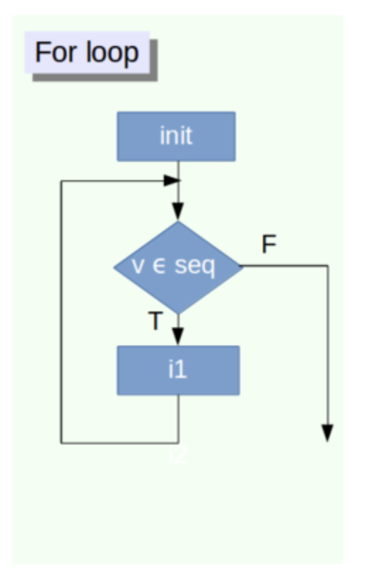
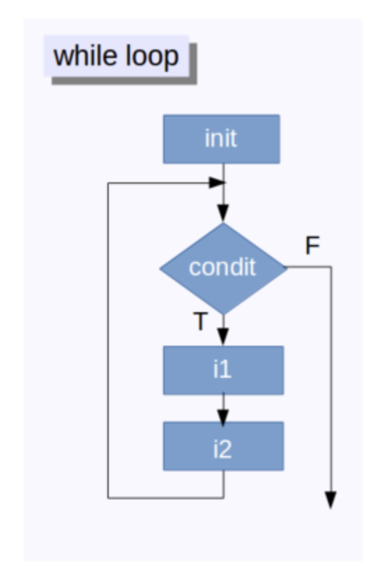

name: toc

```{css, echo=FALSE}
@media print {
  .has-continuation {
    display: block !important;
  }
}
```

```{r setup, include=FALSE}
options(htmltools.dir.version = FALSE)
library(knitr)
opts_chunk$set(
  fig.align="center", 
  fig.height=4, #fig.width=6, 
  # out.width="748px", #out.length="520.75px",
  dpi=300, #fig.path='Figs/',
  cache=F#, echo=F, warning=F, message=F
  )
library(fontawesome)
library(microbenchmark)
library(data.table)
library(ggplot2)
set.seed(123)
```

# Table of contents

1. [Introduction](#intro)

2. [Loops](#loops)

3. [The Apply Family](#control)

4. [Vectorization](#vector)

---
class: inverse, center, middle
name: intro

# Introduction

<html><div style='float:left'></div><hr color='#EB811B' size=1px width=796px></html>

---

# Agenda

This class will cover loops in R and their quirks

While loops are fundamental to programming, they are slow in R and should be avoided when possible.

There is a nice family of functions called the apply family that can condense loops into better looking code.
 - However, they are still ultimately loops and are just as slow as standard loops.
 
When in doubt, make sure your code is vectorized when possible!

---
class: inverse, center, middle
name: logic

# Loops

<html><div style='float:left'></div><hr color='#EB811B' size=1px width=796px></html>

---

# Motivation: For loop

At times we would look to do the same task multiple times that only changes slightly each iteration.

This can be done with a for loop. 

With for loops, you need something to "loop over" and an index that indicates which iteration you're one.

```{r, echo=FALSE, out.width="25%"}

```

---
# Our First Loop

```{r}
sum_val = 0
for(i in 1:10){
  sum_val = sum_val + i
}
sum_val
sum(1:10)
11*10/2
```

---
# Two Approaches to Loops

There are two approaches to loops, and more specifically, what to loop over.
1. Loop over objects in a vector, list, data.frame, etc.
2. Loop over indexes for that vector, list, data.frame, etc.

For ease of understanding *what* is being looped over, 1. is usually best.
 - However, it requires keeping track of indexes in another variable.
 
For ease of storing variables, 2. is usually easier.
 - However, what exactly is being looped over can be obscured.
 
Neither is always better than another and at some point comes down to personal preference.
---
# Two Approaches: An Example

```{r}
Nsim       = 100         #set number of simulations/draws
norm_draws = rnorm(Nsim) #draw N(0,1) random variables
out1       = rep(0,Nsim) #initialize output 1: MORE ON THIS LATER
out2       = rep(0,Nsim) #initialize output 2: MORE ON THIS LATER
n          = 1           #initialize counter

for(draw in norm_draws){
  out1[n] = draw^2       #square the draw and store it
  n       = n + 1        #advance the counter
} #NOTE THAT A COUNTER IS NEEDED

for(i in 1:Nsim){
  out2[i] = norm_draws[i]^2 #square the ith draw and store it
} #notice no counter needed

all.equal(out1,out2) #test to see if these approaches are the same; they are!

```

---
# More Examples: Advanced Sums

Suppose we wanted to calculate $$\sum_{a=1}^{20}\sum_{b=1}^{15} \frac{e^{\sqrt{a}}\log{(a^5)}}{5+\cos(a)\sin(b)}$$

```{r}
val = 0
for(a in 1:20){
  for(b in 1:15){
    val = val + (exp(sqrt(a))*log(a^5))/(5+cos(a)*sin(b))
  }
}
val
```

The loop works, but it is not needed in R!
 - Will return to this at the end of the lecture.

---
# Preallocation

Many times you'll want to use a loop to "fill up" a matrix or vector. 

It is best practice to "preallocate" this object to the correct size before filling it up.

There are a few reasons for this, but it ultimately comes down to speed:
 - Changing the size of the object inside the loop each iteration makes loops even slower than they already are in R!
 
---
# Preallocation: Example

```{r}
N          = 100000
my_vec     = c(0)
my_vec_pre = rep(0,N)

for(i in 1:N){
  my_vec[i] = i^2
}

for(i in 1:length(my_vec_pre)){
  my_vec_pre[i] = i^2
}
```

--

Both run! But let's look at the speed.

---
# Preallocation: Comparing Speeds

```{r,cache=T}
mbm = microbenchmark(
  "no_preal"={
    my_vec     = c(0)
    for(i in 1:N){
      my_vec[i] = i^2
      }},
  "preal"={
    my_vec_pre = rep(0,N)
    for(i in 1:length(my_vec_pre)){
      my_vec_pre[i] = i^2
      }},times=1000)
mbm
```

--

Bottom line: Preallocate objects whenever possible!

---
# While loops

- For loops are not the only types of loops in R!
- Another type is while loops.
- Instead of looping through objects or indexes, we continue to do something *until* a condition is no longer met.
- This can be really useful for some of the things we will use later on.
- Can be dangerous though: infite loop!
 - Not so much in RStudio, though.

```{r, echo=FALSE, out.width="25%"}

```

---
# Our First While Loop

```{r}
val = 0
n   = 1
while(n < 31){
  val = val + n
  n   = n + 1
}
val
30*31/2
```

The while loop continues to increase $n$ by one and add it to `val` until $n \geq 31$.

---
# Econ Application: English Auctions

Art and other valuable objects are often sold in an ascending auction where the price starts low and bidders continue to increase the price until only one bidder remains.

We can "simulate" these auctions using while loops.

--

Suppose there are $N$ bidders and each bidder $i$ has a "valuation" $v_i$ that summarizes how much she values the object. 

As well, suppose there is some fixed amount $\Delta$ that bidders must increase the price by each round (no more and no less) and bidders continue to alternate until only one bidder remains. Also suppose that the initial price $p_0 = \Delta$.

--

So each round $t$, if a bidder is willing to bid, the price increases to $p_t = p_{t-1} + \Delta$.

--

Bidder $i$ is willing to bid if $v_i \geq p_t$ or $v_i \geq p_{t-1}+\Delta$.

--

Let's go to R.


---
# Another Application: An Easy Fixed Point

In math, a fixed point, $x^*$, of a function $f$ is defined as a value where $f(x^*)=x^*$
 - So a fixed point is a point where when we apply the function to it, we get the original value back!
 
--

While loops can be used to calculate these when they exist.

The idea is to keep applying the function over and over again until the values are "close enough"

So $x_{n+1} = f(x_n)$. If $| x_{n+1} - x_n |$ is "small," we stop. 

If not, replace $x_n$ with $x_{n+1}$, and continue.
 - So $x_{n+2} = f(x_{n+1})$ and then compare $x_{n+2}$ and $x_{n+1}$.

--

We will use the function $f(x)=\sqrt{x}$.

$\sqrt{1} = 1$ and $\sqrt{0}=0$. So these are our candidate fixed points.

However, we will only get to one of them no matter which starting values we start at.

---
# Calculating Fixed Points

```{r}
eps   = .Machine$double.eps #set tolerance 
x_n   = 5000                #starting guess
x_np1 = sqrt(x_n)           #apply function

while(abs(x_n - x_np1) > eps){
  x_n   = x_np1     #update guess
  x_np1 = sqrt(x_n) #apply function
}
x_np1
```

```{r}
x_n   = 0.00001             #starting guess
x_np1 = sqrt(x_n)           #apply function

while(abs(x_n - x_np1) > eps){
  x_n   = x_np1     #update guess
  x_np1 = sqrt(x_n) #apply function
}
x_np1
```
---
# Implementing Fail-Safes

When writing while loops, it is often good practice to implement a fail-safe so that the while loop doesn't run for forever.

--

This could be because the code isn't converging as quickly as we'd like or there's an error and the code will never converge because you wrote it wrong.

--

I did not need one above because that question has really good convergence properties (and I trust my code `r fa("smile")`).

--

To implement a fail-safe, we need to create a new variable and use some of the logical properties we talked about last lecture.

--

Ideas?

--

We want it to stop when $|x_{n+1}-x_n|<\varepsilon$ **or** $n > \bar{N}$ where $\bar{N}$ is some maximum number of iterations we set. 

So what is the "while condition?" Hint: DeMorgan's Law!

---
# Implementing a Fail-Safe

```{r}
x_n   = 50000               #starting guess
x_np1 = sqrt(x_n)           #apply function
n     = 1
MaxIt = 100000

while(abs(x_n - x_np1) > eps & n < MaxIt){
  x_n   = x_np1     #update guess
  x_np1 = sqrt(x_n) #apply function
  n     = n + 1     #increase counter
}

#check to see why loop stopped
if(abs(x_n - x_np1) > eps){
  stop("Did not find fixed point!")
} else{
  print(c(x_np1,n))
}
```
---
# Fail-Safes (Fixed Points)

Fixed points don't always exist, and even when they do, we're not always guaranteed to find them via the iterative procedure I described.

That's where these fail safes can come into play. 

--

Consider the function $f(x)=2x$. $f$ has a fixed point (and only one fixed point) at $x=0$; however, we are not guaranteed to ever find it via the iterative procedure.

Therefore, the fail safe needs to be triggered so our loop doesn't go on forever.

---
# Necessary Fail-Safes

```{r,error=T}
x_n   = 0.0001 #starting guess
x_np1 = 2*x_n  #apply function
n     = 1      #initialize counter
MaxIt = 1000   #fix max iterations

while(abs(x_n - x_np1) > eps & n < MaxIt){
  x_n   = x_np1     #update guess
  x_np1 = 2*x_n     #apply function
  n     = n + 1     #increase counter
}

if(abs(x_n - x_np1) > eps){
  stop("Did not find fixed point!")
} else{
  print(c(x_np1,n))
}
```

---
# Repeat Loops

In R, there is a third kind of loop: the repeat loop. 

The repeat loop will continue to do something until you manually break it.

These are slightly different than while loops; however, while loops can be used to replicate their behavior quite easily. 

I would mostly recommend avoiding repeat loops.

---
# Repeat Loops

```{r}
val = 0
n   = 1
repeat{
  val = val + n
  n   = n + 1
  if(val > 30) break
}
print(c(val, n))

val = 0
n   = 1
while(TRUE){
  val = val + n
  n   = n + 1
  if(val > 30) break
}
print(c(val, n))
```

---

class: inverse, center, middle
name: apply

# The Apply Family of Functions

<html><div style='float:left'></div><hr color='#EB811B' size=1px width=796px></html>

---
# The Apply Family

In R, there are a family of functions called the apply family.

They can be used to write loops in a much more compact format. 

The idea is to have some vector-like object that you would to do something to in a for-loop like manner, and then "apply" some function to each element of the object.

If you'd like to see more about the apply family, I would recommend following the `swirl` tutorial for more.

---
# The Apply Function

The first one we will look at is the apply function.

It takes three arguments:
1. an array (matrix, vector, etc.)
2. a "margin" (which dimension to apply over)
3. a function

--

It takes the array and then applys the function over the dimension that is specified in the margins argument.

---
# Apply: An Example

```{r}
rand_mat = matrix(rnorm(3*2),ncol=3)
rand_mat
apply(rand_mat,1,sum)
apply(rand_mat,2,sum)
```

- MARGIN = 1, the sum function is applied to each row.
 - So we are summing across columns
- MARGIN = 2, the sum function is applied to each column.
 - So we are summing across rows.
 
---
# Apply's Connection to Loops

It might not be entirely obvious apply's connection to loops. 

When MARGIN = 1, this is what apply is doing:
```{r}
out = rep(0,nrow(rand_mat))
for(i in 1:nrow(rand_mat)){
  out[i] = sum(rand_mat[i,])
}
out
```

--

Likewise, when MARGIN = 2, this is what apply is doing:

```{r}
out = rep(0,ncol(rand_mat))
for(i in 1:ncol(rand_mat)){
  out[i] = sum(rand_mat[,i])
}
out
```

---
# Beyond Apply

As seen above, apply can simplify loops and results in much cleaner code.
 - Though, is it more readable?

While the apply function is useful, it has it's limitations. 

1. It can only be used on array-like objects. 
2. It will only return a vector or array.

There are other functions that can be used on a wider class of objects along with return non-arrays.
- lapply: returns a list the same length as the ob ject
- sapply: returns the "most simple" version of the output of lapply that makes sense.
 - I know, this sounds ambiguous because it is!
- vapply: the same as sapply, but an output type must be specified.
 - Generally, safer to use.
- tapply
 - I have never used this one. Just know it exists.

---
# x-apply Examples

```{r}
my_list = list(a = 1:10, beta = exp(-3:3), logic = c(TRUE,FALSE,FALSE,TRUE))
my_list
lapply(my_list, mean)

```
---
# x-apply Examples (Cont.)

```{r}
sapply(my_list, mean)
lapply(my_list, quantile, probs = (1:3)/4)
```

---
# x-apply Examples (Cont.)

```{r}
sapply(my_list, quantile)
```

---
# x-apply Examples (Cont.)

By default, sapply will apply functions to columns (across rows) of data.frames. i.e. MARGIN =  2 in the apply function. 

Note, there is no MARGIN argument for sapply, lapply, or vapply.

```{r}
data(mtcars)
sapply(mtcars,summary)
```

---

class: inverse, center, middle
name: vector

# Vectorization

<html><div style='float:left'></div><hr color='#EB811B' size=1px width=796px></html>
---
# To Loop or Not To Loop

Generally in R, you want to avoid loops at all costs. This is because they are slow!

Developing your programming style in R requires learning when to use loops.

```{r,cache = T}
mbm = microbenchmark(
  "loop"={
    N   = 100000    #set size of vector
    out = rep(0, N) #preallocate vector
    for(i in 1:N){
      out[i] = i^2  #fill in vector with square of index
      }},
  "vectorized"={
    N   = 100000    #set size of vector
    out = 1:N       #preallocate vector
    out = out^2     #square each index
   },times=1000)
mbm
```

---
# Returning To Advanced Sums
Earlier, we wanted to calculate the following sum: $$\sum_{a=1}^{20}\sum_{b=1}^{15} \frac{e^{\sqrt{a}}\log{(a^5)}}{5+\cos(a)\sin(b)}$$

While we used a loop, it was not necessary. If we expand out every combination of $a$ and $b$, then, we can use vectorized operations.

```{r}
aANDb = expand.grid(a=1:20,b=1:15)
a     = aANDb$a
b     = aANDb$b
sum((exp(sqrt(a))*log(a^5))/(5+cos(a)*sin(b)))
```
---
# Benchmarking These Sums
```{r, cache=T}

mbm = microbenchmark(
  "loop"={
    val = 0
    for(a in 1:20){
      for(b in 1:15){
        val = val + (exp(sqrt(a))*log(a^5))/(5+cos(a)*sin(b))}}},
  "vectorized"={
    aANDb = expand.grid(a=1:20,b=1:15)
    a     = aANDb$a
    b     = aANDb$b
    sum((exp(sqrt(a))*log(a^5))/(5+cos(a)*sin(b)))
   },times=1000)
mbm
mean(mbm[mbm$expr=="loop","time"])/mean(mbm[mbm$expr=="vectorized","time"])
```

---
# When Must We Use Loops?

Sometimes, the use of a loop cannot be avoided. This might be for the following reasons:

1. Calculations depend on previous calculations.
2. The size of an "inner loop" changes based on the values of the "outer loop."
3. Too difficult to do the "prep-work" mentally for the vectorized operations.

---
# Calculations That Depend on Others

An $AR(1)$ Time Series is a perfect example of an economic application where a loop is absolutely necessary.

An $AR(1)$ model says that today's value of $y$, called $y_t$, depends on yesterday's, $y_{t-1}$, scaled by some value $\rho$, plus some constant $\delta$, plus some error term $\varepsilon_t$.

In math, that is $$y_t = \delta + \rho y_{t-1}+\varepsilon_t$$

```{r}
rho       = 0.5
delta     = 2
N         = 1000
AR1_ts    = rep(0,N)
AR1_ts[1] = delta + rho*(delta/(1-rho)) + rnorm(1)
for(i in 2:N){
  AR1_ts[i] = delta + rho*AR1_ts[i-1] + rnorm(1)
}
```

Note: I did not use $t$ as the loop variable because of the function `t()`. I did not want to cause a namespace conflict.
---
# AR(1) Plot

```{r,echo=F}
plot_data = data.table(y=AR1_ts,x=1:N)
ggplot(plot_data,aes(x=x,y=y))+geom_line()
```

---
# Inner Loop Dependency

Sometimes when loops are nested (like our advanced sums), the inner loops will depend on values of the outer loop. 

In this case, loops cannot be entirely avoided.
 - Though, they can be minimized.
 
Consider a slight modification of the advanced sum we saw earlier $$\sum_{a=1}^{20}\sum_{b=1}^{a} \frac{e^{\sqrt{a}}\log{(a^5)}}{5+\cos(a)\sin(b)}$$

Instead of looping b from $1$ to $15$, now the max value of $b$ depends on the current value of $a$.

In this case, a loop cannot be avoided.
 - At least, without making a specialized grid which will be very tedious.

---
# Dependent Loops

```{r}
val = 0
for(a in 1:20){
  for(b in 1:a){
    val = val + (exp(sqrt(a))*log(a^5))/(5+cos(a)*sin(b))
  }
}
val
```

With some thinking and brute force, the loops might be able to be eliminated. But it will be tedious.

However, if the speed of your code matters, it is worth spending the time to do this!
---
# In Conclusion

Loops are very valuable to understand conceptually, but should be avoided when implementing code in R.

There are variations on loops called while loops that can be very useful when computing things.

There are a family of functions called the apply family which condense loops into more compact syntax. However, they are still loops at heart (and just as slow).

For further experience, use `swirl` for loops and the apply functions.

For further reading, please see [this link](https://www.datacamp.com/community/tutorials/tutorial-on-loops-in-r). It was very helpful when making these slides.
---

class: inverse, center, middle

# Next lecture(s): Functions

<html><div style='float:left'></div><hr color='#EB811B' size=1px width=796px></html>


```{r gen_pdf, include = FALSE, cache = FALSE, eval = TRUE}
infile = list.files(pattern = '.html')
pagedown::chrome_print(input = infile, timeout = 100)
```